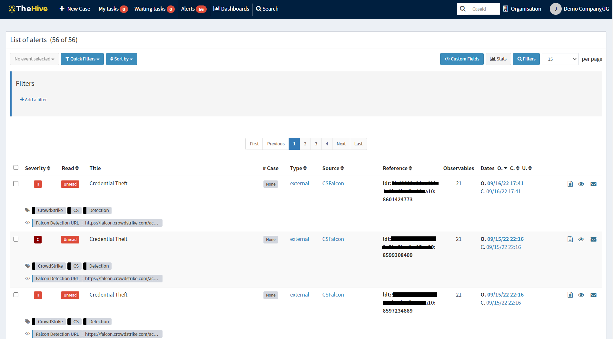
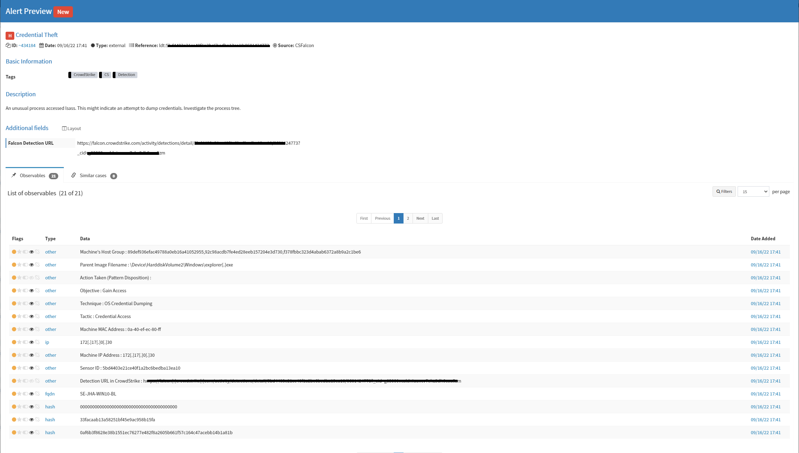

# falcon2thehive

A simple Python connector that allows to send your CrowdStrike Falcon detections to your The Hive platform.
Currently validated with The Hive v4.1.23.

## Pre-requisites :
- Python3 
- The Hive API for Python (https://github.com/TheHive-Project/TheHive4py)
- FalconPy SDK (https://github.com/CrowdStrike/falconpy)


## Configuration :
Edit the `falcon2thehive` script and adapt the following lines with your own values :
```
g_client_id = 'XXXXXXXXXXXXXX'    # Your Falcon API's Client ID
g_client_secret = 'YYYYYYYYYY'    # Your Falcon API's Secret        
THEHIVE_URL = 'http://127.0.0.1:9000'   # IP Address of your Hive instance
THEHIVE_API_KEY = 'XXXXXXXXXXXXXXX'     # Your Hive API Key
```


## Usage :
To run the script on background :
`falcon2thehive.py &`


## Screenshots :


